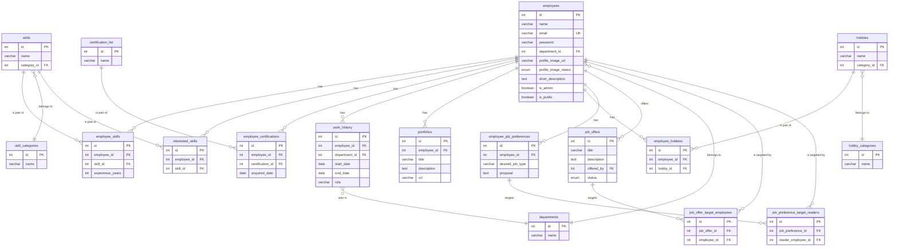

```mermaid
erDiagram
    employees {
        int id PK
        varchar name
        varchar email UK
        varchar password
        int department_id FK
        varchar profile_image_url
        enum profile_image_status
        text short_description
        boolean is_admin
        boolean is_public
    }

    departments {
        int id PK
        varchar name
    }

    skill_categories {
        int id PK
        varchar name
    }

    skills {
        int id PK
        varchar name
        int category_id FK
    }

    employee_skills {
        int id PK
        int employee_id FK
        int skill_id FK
        int experience_years
    }

    interested_skills {
        int id PK
        int employee_id FK
        int skill_id FK
    }

    certification_list {
        int id PK
        varchar name
    }

    employee_certifications {
        int id PK
        int employee_id FK
        int certification_id FK
        date acquired_date
    }

    work_history {
        int id PK
        int employee_id FK
        int department_id FK
        date start_date
        date end_date
        varchar role
    }

    portfolios {
        int id PK
        int employee_id FK
        varchar title
        text description
        varchar url
    }

    hobby_categories {
        int id PK
        varchar name
    }

    hobbies {
        int id PK
        varchar name
        int category_id FK
    }

    employee_hobbies {
        int id PK
        int employee_id FK
        int hobby_id FK
    }

    job_offers {
        int id PK
        varchar title
        text description
        int offered_by FK
        enum status
    }

    job_offer_target_employees {
        int id PK
        int job_offer_id FK
        int employee_id FK
    }

    employee_job_preferences {
        int id PK
        int employee_id FK
        varchar desired_job_type
        text proposal
    }

    job_preference_target_readers {
        int id PK
        int job_preference_id FK
        int reader_employee_id FK
    }

    employees ||--o{ employee_skills : "has"
    employees ||--o{ interested_skills : "has"
    employees ||--o{ employee_certifications : "has"
    employees ||--o{ work_history : "has"
    employees ||--o{ portfolios : "has"
    employees ||--o{ employee_hobbies : "has"
    employees ||--o{ employee_job_preferences : "has"
    employees ||--o{ job_offers : "offers"
    employees }o--|| departments : "belongs to"

    skills ||--o{ employee_skills : "is part of"
    skills }o--|| skill_categories : "belongs to"
    skills ||--o{ interested_skills : "is part of"

    certification_list ||--o{ employee_certifications : "is part of"

    work_history }o--|| departments : "was in"

    hobbies ||--o{ employee_hobbies : "is part of"
    hobbies }o--|| hobby_categories : "belongs to"

    job_offers ||--o{ job_offer_target_employees : "targets"
    employees ||--o{ job_offer_target_employees : "is targeted by"

    employee_job_preferences ||--o{ job_preference_target_readers : "targets"
    employees ||--o{ job_preference_target_readers : "is targeted by"
```